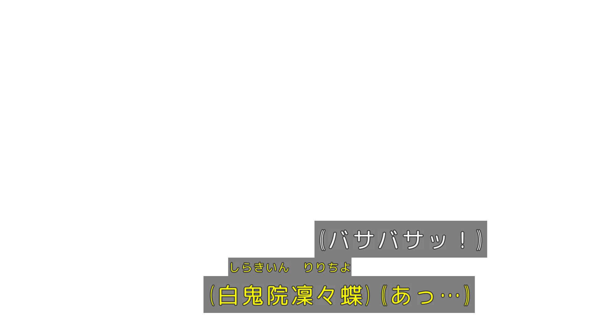

libaribcaption
======
[English](README.md)

テレビ放送の ARIB STD-B24 字幕をデコードしたり、レンダリングしたりするクロスプラットフォーム対応のライブラリです。

## 背景
デジタルテレビ放送で ATSC 規格を採用した北米では、**CEA-608/708** 規格の字幕（クローズドキャプション）が使われています。
DVB 規格を採用しているヨーロッパをはじめとする国々では、**DVB Subtitles** または **DVB Teletext** の形で字幕表示に対応しています。
一方、日本は電波産業会が **ISDB** という放送規格を独自に制定しました。中では **ARIB STD-B24** 規格の字幕仕様が含まれています。

ブラジルのデジタル放送も ISDB-T International を採用しています。
日本の ISDB 規格を基礎としつつ、いくつかの改良が含まれるブラジル方式 **SBTVD / ISDB-Tb** となっており、南米諸国にも採用されています。
ブラジル方式の中でも **ABNT NBR 15606-1** にて字幕の規格が定義されており、 ARIB STD-B24 から改造してラテン語支援に向けたものです。
フィリピンもブラジル版の ISDB-T International を採用していますが、字幕規格はブラジルの ABNT 仕様ではなく、
日本の ARIB STD-B24 仕様を基づいて文字コードを **UTF-8** に移行したものです。

ISDB 方式のデジタルテレビ放送はすでに 20 年近く行われていましたが、ARIB 字幕はまだほとんどの動画プレイヤーにサポートされていません。

## 概要
libaribcaption は ARIB 字幕を扱うためのデコーダーとレンダラーを提供し、
汎用的な動画プレイヤーにおいてもテレビと同じ効果で ARIB 字幕を再現できるようにしています。

libaribcaption は C++17 で開発されましたが、動画プレイヤーに導入しやすくなるため、C の API も同時に提供しています。
libaribcaption は最悪の場合でも libfreetype と libfontconfig のみに依存するので、非常に軽量なライブラリです。

libaribcaption はさまざまな OS やプラットフォームで使えます：

- Windows 7+
- Windows XP+  (libfreetype 必須)
- Linux  (libfreetype と libfontconfig が必須)
- Android 2.x+  (libfreetype 必須)
- macOS
- iOS
- など

## スクショ


## 機能
- 日本語字幕（ARIB STD-B24 JIS）、南米国家のラテン語字幕（ABNT NBR 15606-1）、およびフィリピンの字幕（UTF-8）の支援
- DRCS および ARIB 外字の支援
- さまざまなプラットフォームで動ける軽量なライブラリ
- 最適化された画像処理（x86/x64 において SSE2 による最適化も含まれている）
- DirectWrite, CoreText, FreeType を用いる複数なレンダリングバックエンドが選択可能
- Windows または macOS / iOS においてサードパーティ依存なしで使用可能（DirectWrite / CoreText 利用）
- 内蔵したフォントフォールバック機能
- 内蔵した DRCS 置換機能および DRCS 置換テーブル

## ビルド
CMake 3.11+ と C++17 対応のコンパイラが必要です。
```bash
cd libaribcaption
mkdir build
cd build
cmake .. -DCMAKE_BUILD_TYPE=Release
cmake --build . -j8
cmake --install .      # Optional
```

ディフォルトとして、libaribcaption はスタティックライブラリにコンパイルされます。
`ARIBCC_SHARED_LIBRARY:BOOL=ON` を指定すると、シェアードライブラリ（dll / so / dylib）にコンパイルできます。
```bash
cmake .. -DCMAKE_BUILD_TYPE=Release -DARIBCC_SHARED_LIBRARY:BOOL=ON    # or -DBUILD_SHARED_LIBS:BOOL=ON
```

libaribcaption はいくつかの CMake オプションを用意しています：
```bash
ARIBCC_BUILD_TESTS:BOOL            # Compile test codes inside /test. Default to OFF
ARIBCC_SHARED_LIBRARY:BOOL         # Compile as shared library. Default to OFF
ARIBCC_NO_EXCEPTIONS:BOOL          # Disable C++ Exceptions. Default to OFF
ARIBCC_NO_RTTI:BOOL                # Disable C++ RTTI. Default to OFF
ARIBCC_NO_RENDERER:BOOL            # Disable the renderer and leave only the decoder behind. Default to OFF
ARIBCC_IS_ANDROID:BOOL             # Indicate target platform is Android. Detected automatically by default.
ARIBCC_USE_DIRECTWRITE:BOOL        # Enable DirectWrite font provider & renderer. Default to ON on Windows
ARIBCC_USE_GDI_FONT:BOOL           # Enable GDI font provider which is necessary for WinXP support. Default to OFF.
ARIBCC_USE_CORETEXT:BOOL           # Enable CoreText font provider & renderer. Default to ON on macOS / iOS
ARIBCC_USE_FREETYPE:BOOL           # Enable FreeType based renderer. Default to ON on Linux / Android
ARIBCC_USE_EMBEDDED_FREETYPE:BOOL  # Use embedded FreeType instead of searching system library. Default to OFF
ARIBCC_USE_FONTCONFIG:BOOL         # Enable Fontconfig font provider. Default to ON on Linux and other platforms
```

ディフォルトとして、Windows および macOS / iOS においては OS が提供した DirectWrite と CoreText のみが使われます。
ただ、`ARIBCC_USE_FREETYPE:BOOL=ON` を指定すれば、FreeType ベースのレンダリングバックエンドをオンにすることも可能です。

Windows XP を支援したい場合は、DirectWrite を禁止し、GDI font provider と FreeType をオンにする必要があります：
```bash
cmake .. -DCMAKE_BUILD_TYPE=Release -ARIBCC_USE_DIRECTWRITE:BOOL=OFF -DARIBCC_USE_GDI_FONT:BOOL=ON -DARIBCC_USE_FREETYPE:BOOL=ON
```

Windows で FreeType または Fontconfig を利用する際に、`vcpkg` または `msys2` の使用を検討してください。

Android NDK または Windows など、システムワイドでインストールされる FreeType の用意が困難な環境であれば、
`-DARIBCC_USE_EMBEDDED_FREETYPE:BOOL=ON` をつけて、埋め込み FreeType の利用を検討してください。
このオプションをオンにした場合、FreeType のソースが自動的にダウンロードされ、
libaribcaption にリンクされるスタティックライブラリにコンパイルされます。

## 使用
libaribcaption がシステムにインストールされた場合、CMake の `find_package()` でインポートできます：
```cmake
cmake_minimum_required(VERSION 3.11)
project(testarib LANGUAGES C CXX)

find_package(aribcaption REQUIRED)

add_executable(testarib main.cpp)

target_compile_features(testarib
    PRIVATE
        cxx_std_17
)

target_include_directories(testarib
    PRIVATE
        ${ARIBCAPTION_INCLUDE_DIR}
)

target_link_libraries(testarib
    PRIVATE
        aribcaption::aribcaption
)
```

または、`add_subdirectory()` でソースコードのフォルダーを直接インポートできます:
```cmake
cmake_minimum_required(VERSION 3.11)
project(testarib2 LANGUAGES C CXX)

set(ARIBCC_USE_FREETYPE ON CACHE BOOL "Enable FreeType")    # Indicate options here (optional)
add_subdirectory(thirdparty/libaribcaption)

add_executable(testarib2 main.cpp)

target_compile_features(testarib2
    PRIVATE
        cxx_std_17
)

target_link_libraries(testarib2
    PRIVATE
        aribcaption::aribcaption
)
```

もしくは、pkg-config 経由で使用することもできます（インストールされた場合）：
```bash
# Link to libaribcaption static library
gcc main.c -o main `pkg-config --cflags --libs --static libaribcaption`

# Link to libaribcaption shared library
gcc main.c -o main `pkg-config --cflags --libs libaribcaption`
```

## ドキュメント
[public headers](include/aribcaption) のコメントまたは [sample code with ffmpeg](test/ffmpeg) を直接に読んでください。

## ヒント
libaribcaption の public headers も C++17 で書かれているため、使用する際にも C++17 対応のコンパイラが必要です。
もし開発環境が C++17 に対応できない場合は、C API の使用を検討してください。

libaribcaption の C API (拡張子が ".h" の [public headers])は C または他の言語から呼び出すために役立ちます。
[capi sample](test/capi) を参考してください。

[public headers]: include/aribcaption

## おすすめのフォント
Windows TV MaruGothic

Hiragino Maru Gothic ProN (macOS)

[Rounded M+ 1m for ARIB](https://www.axfc.net/u/3107925)

[和田研中丸ゴシック2004ARIB](https://ja.osdn.net/projects/jis2004/wiki/FrontPage)

## ライセンス
MIT License とします。再配布の際に copyright notice と permission notice を添付してください。

## 参考資料
[ARIB STD-B24](https://www.arib.or.jp/english/std_tr/broadcasting/std-b24.html)

[ARIB TR-B14](https://www.arib.or.jp/english/std_tr/broadcasting/tr-b14.html)

ABNT NBR 15606-1

[ISDB-T Standards (Philippines)](https://ntc.gov.ph/wp-content/uploads/2018/MC/MC-07-12-2014-Attachment.pdf)

## 関連実装
libaribcaption は以下のプロジェクトからインスピレーションを得ています：

[aribb24](https://github.com/nkoriyama/aribb24)

[aribb24.js](https://github.com/monyone/aribb24.js)

[TVCaptionMod2](https://github.com/xtne6f/TVCaptionMod2)
